# OpenClaw Man

OpenClaw Man 是一个开源解决方案，旨在通过中间件服务端作为桥梁，实现微信小程序与 [OpenClaw](https://github.com/openclaw/openclaw) AI 系统的无缝交互。本项目采用模块化设计，支持自定义机器人接入、实时流式对话以及多会话管理。

## 🏗 整体架构

本项目由三个核心工程组成，分别承担前端交互、消息路由和后端集成的职责：

1.  **[OpenClaw Man App](openclaw-man-app/README.md)** (微信小程序)
    *   **角色**: 用户终端。
    *   **功能**: 提供类似微信的聊天界面，支持用户登录、多机器人配置、历史消息查看等功能。
    *   **交互**: 通过 WebSocket 直连 `OpenClaw Man Server`。

2.  **[OpenClaw Man Server](openclaw-man-server/README.md)** (服务端)
    *   **角色**: 核心桥梁与状态管理器。
    *   **功能**: 
        *   维护与小程序的 WebSocket 连接。
        *   管理用户会话 (Session) 和鉴权。
        *   作为中转站，将消息转发至 OpenClaw 并接收 AI 回复。
    *   **技术栈**: Python, FastAPI, Websockets, MySQL。

3.  **[OpenClaw cloud-bot-channel Channel](openclaw-man-we-app-channel/README.md)** (OpenClaw 插件)
    *   **角色**: OpenClaw 的渠道适配器。
    *   **功能**: 安装在 OpenClaw 内部，注册一个新的 `cloud-bot-channel` 渠道，使 OpenClaw 能够识别并处理来自小程序的消息格式。

### 交互流程

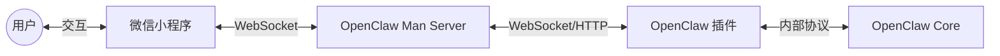

## 📂 项目目录说明

| 目录 | 项目名称 | 说明 |
| :--- | :--- | :--- |
| [`openclaw-man-app/`](openclaw-man-app/) | **App 客户端** | 基于微信原生开发的小程序源码。 |
| [`openclaw-man-server/`](openclaw-man-server/) | **中间件服务端** | 基于 Python 的后端服务，支持 Docker 部署。 |
| [`openclaw-man-we-app-channel/`](openclaw-man-we-app-channel/) | **渠道插件** | Node.js 编写的 OpenClaw 插件源码。 |

## 🚀 部署指南

要搭建一套完整的环境，请按照以下顺序进行部署：

1.  **启动服务端**
    *   进入 `openclaw-man-server`，配置数据库并启动服务（推荐使用 Docker Compose）。
    *   确保 WebSocket 端口（默认 8812）对外可访问。

2.  **配置 OpenClaw**
    *   进入 `openclaw-man-we-app-channel`，构建插件包 (`.zip`)。
    *   在 OpenClaw 中安装插件，并在配置文件中填入 Server 的连接信息。

3.  **运行小程序**
    *   使用微信开发者工具打开 `openclaw-man-app`。
    *   构建 npm 依赖。
    *   在小程序中添加机器人，填入 Server 的 API 地址和鉴权密钥。

详细的开发和使用文档，请参考各子目录下的 `README.md`。

## 截图预览

| | |
|:---:|:---:|
| 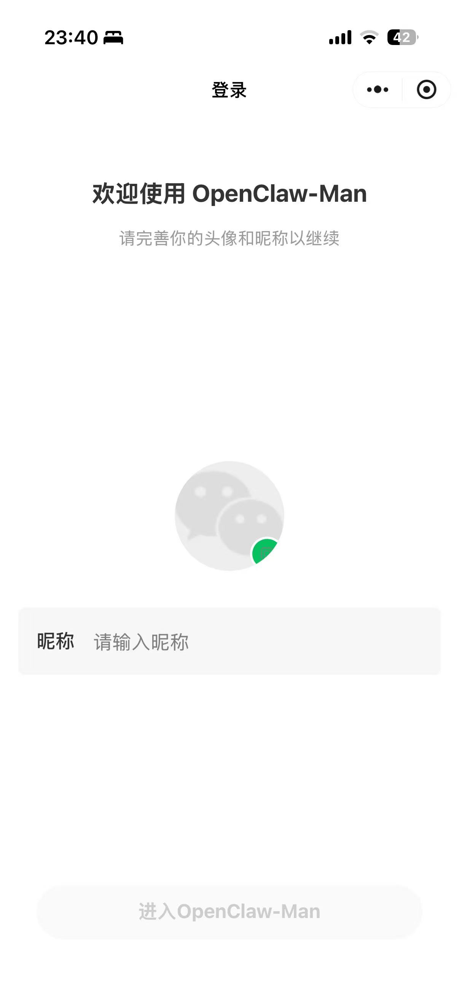 登录小程序 | 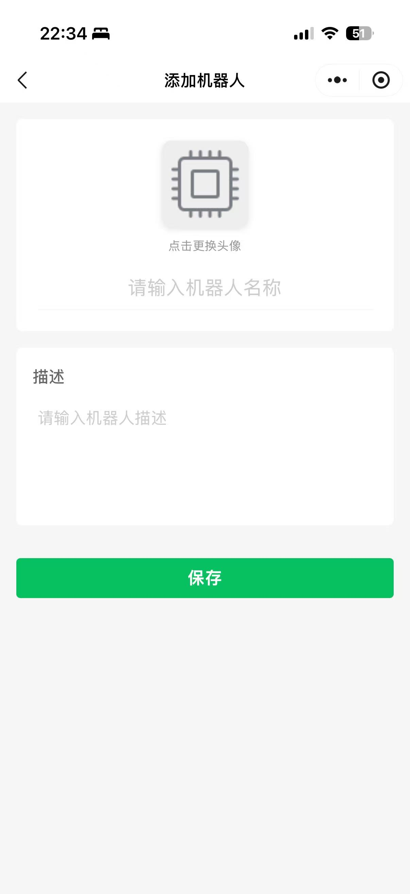 已创建的机器人列表 |
| 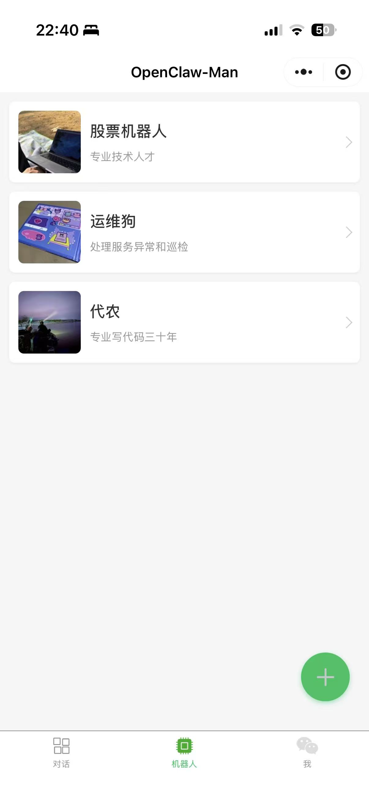 创建机器人 | 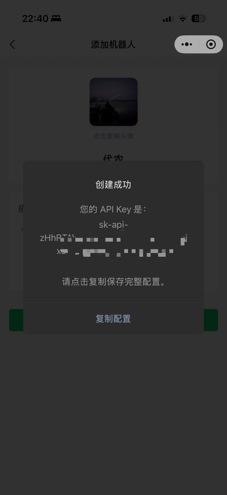 创建成功机器人唯一连接信息 |
| 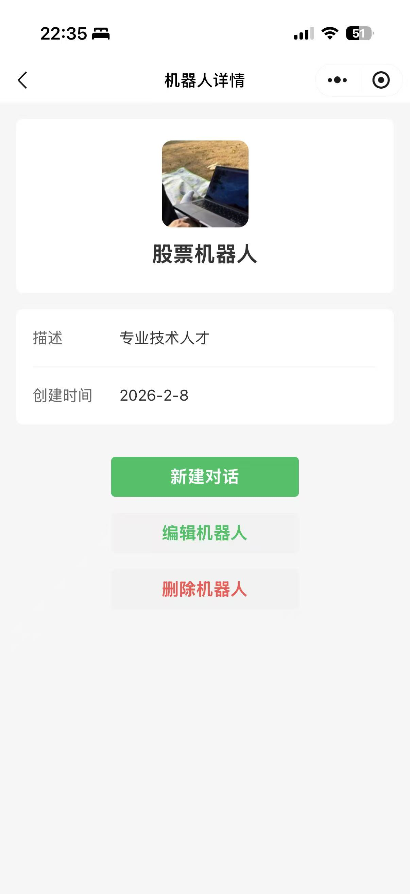 机器人详细信息 | 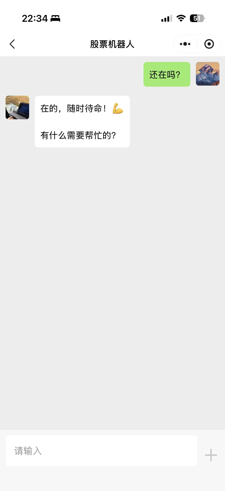 机器人对话1 |
| 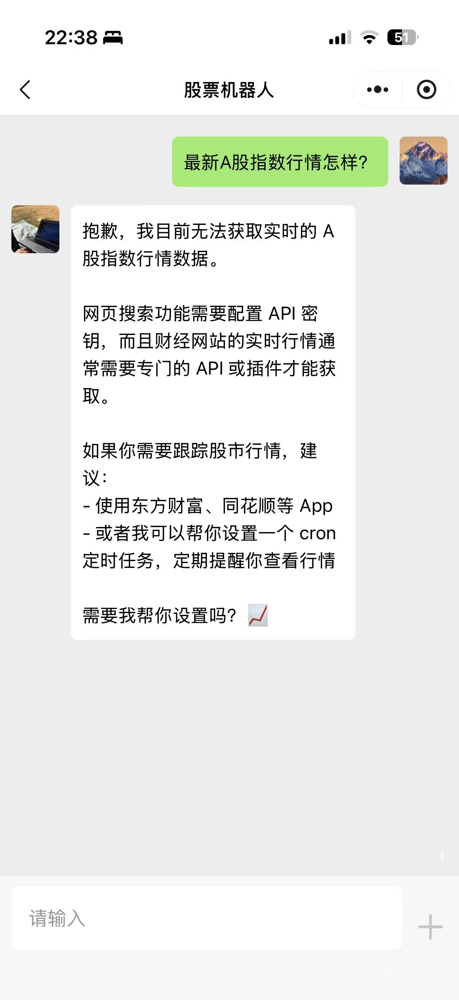 机器人对话2 | 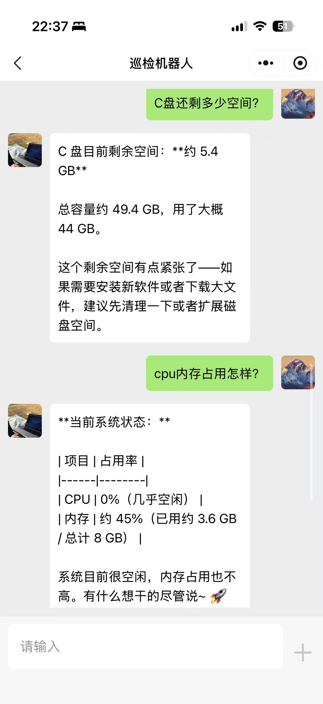 机器人对话3 |
| 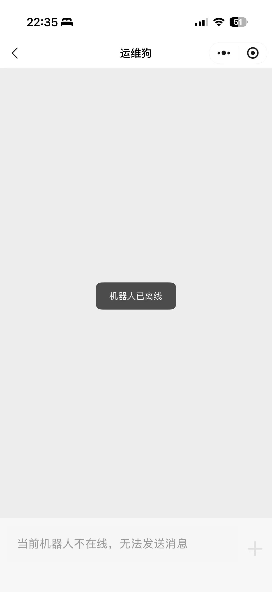 机器人不在线 | 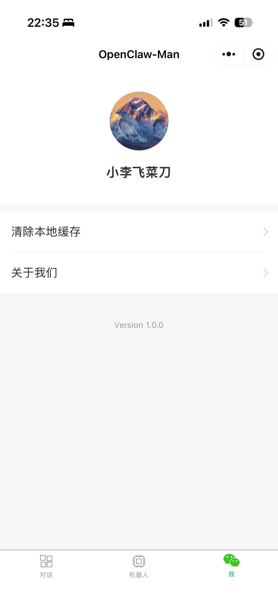 个人信息 |

