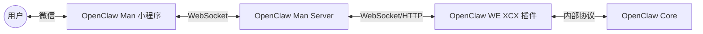

# 小程序接入 OpenClaw：打造你的随身 AI 助理

## 1. OpenClaw 是什么？

OpenClaw 是一款运行在你本地设备上的个人 AI 助手（Personal AI Assistant）。与普通的聊天机器人不同，OpenClaw 被设计为“真正能做事”的 AI（The AI that actually does things）。

它的核心特点包括：
*   **本地优先**：可以运行在 macOS, Linux, Windows 上，数据掌握在自己手中。
*   **强大的连接能力**：它不仅仅是陪你聊天，更能连接你的数字生活。它可以清除收件箱、发送邮件、管理日历、甚至帮你办理航班值机。
*   **多渠道支持**：官方支持 WhatsApp, Telegram, Discord, Slack, Signal, iMessage 等多种通讯软件，让你随时随地都能呼叫你的 AI 助理。
*   **技能（Skills）扩展**：通过安装各种 Skill，OpenClaw 可以获得新的能力，比如访问 GitHub、控制智能家居等。

简单来说，OpenClaw 就是一个拥有“手脚”的 AI Agent，它能听懂你的指令，并帮你执行实际的操作。

## 2. 为什么要开发 OpenClaw Man？

虽然 OpenClaw 的生态非常丰富，支持了众多国际主流的即时通讯软件，但在国内环境下，我们最常用的 **微信（WeChat）** 却一直缺席。

*   **现状**：目前国内仅有少数企业级应用有通过插件或 webhook 对接 OpenClaw 的方案。
*   **痛点**：对于普通个人用户而言，微信才是最高频的入口。如果想在微信里使用 OpenClaw，此前几乎没有现成的解决方案。
*   **解决方案**：为了填补这个空白，**OpenClaw Man** 应运而生。本项目通过开发一个自定义的 OpenClaw Channel（渠道插件）以及配套的中间件，实现了通过**微信小程序**直接与 OpenClaw 交互的能力。

现在，你无需切换应用，打开微信小程序，就能与你部署在电脑或服务器上的 OpenClaw 进行对话，让它帮你处理事务。

## 3. 整体架构介绍

OpenClaw Man 采用模块化设计，由三个核心部分组成，共同完成消息的流转与处理：

### 3.1 OpenClaw Man App (微信小程序)
这是用户直接接触的前端界面。
*   **体验**：提供类似原生微信的聊天体验。
*   **功能**：支持用户登录、多机器人配置（可以连接多个 OpenClaw 实例）、查看历史消息。
*   **技术**：基于微信原生开发，轻量高效。

### 3.2 OpenClaw Man Server (中间件服务端)
这是连接小程序与 OpenClaw 的桥梁。
*   **职责**：由于微信小程序对通信协议有严格要求，且 OpenClaw 内部协议较为复杂，Server 端负责维护与小程序的 WebSocket 长连接，处理用户鉴权（Session 管理），并将消息路由转发给 OpenClaw。
*   **技术栈**：Python, FastAPI, Websockets, MySQL。

### 3.3 OpenClaw WE XCX Channel (OpenClaw 插件)
这是安装在 OpenClaw 内部的适配器。
*   **职责**：它在 OpenClaw 中注册了一个名为 `we-xcx` 的新渠道。它负责将来自 Server 的消息转换为 OpenClaw 能理解的格式，并将 AI 的流式回复（Streaming Response）实时回传给 Server。
*   **技术栈**：Node.js (OpenClaw 插件标准)。

## 4. 开源地址

本项目已完全开源，欢迎 Star 和 Fork！

*   **GitHub 项目主页**: [https://github.com/gb198871/openclaw-man](https://github.com/gb198871/openclaw-man)

（注：项目包含 App、Server、Channel 插件三个子目录，部署时请参考 README 文档。）

## 5. 使用效果

部署完成后，你将获得以下体验：

1.  **极速连接**：打开小程序，即可自动连接到你的 OpenClaw 实例。
2.  **流式对话**：AI 的回复是实时打字机效果显示的，无需漫长等待。
3.  **随时待命**：无论你身在何处，只要有网络，你的 OpenClaw 就在微信里等你。你可以让它总结文章、查询代码、或者通过 Skill 执行服务器命令。
4.  **多端同步**：你在小程序里的对话，OpenClaw 后台均有记录，保证上下文的连续性。

