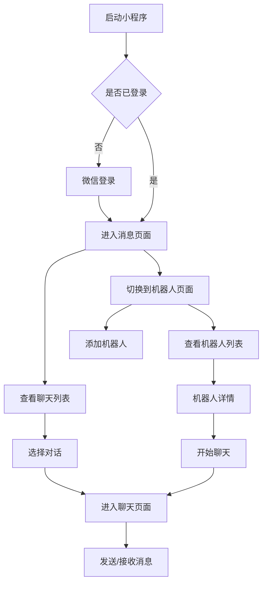

## 1. 产品概述
这是一个基于微信小程序的AI机器人聊天应用，用户可以通过微信登录后添加多个AI机器人进行对话。产品主要解决用户与多个AI助手便捷沟通的需求，提供类似微信的聊天体验。

目标用户：需要与多个AI机器人进行日常交流、工作协助的个人用户和小型团队。

## 2. 核心功能

### 2.1 用户角色
| 角色 | 注册方式 | 核心权限 |
|------|----------|----------|
| 普通用户 | 微信授权登录 | 添加机器人、发起聊天、管理个人信息 |

### 2.2 功能模块
应用包含以下核心页面：
1. **消息页面**：聊天列表，显示所有活跃的机器人对话
2. **机器人页面**：机器人管理，包含添加和已添加机器人列表
3. **我的页面**：个人信息展示，微信登录入口
4. **聊天页面**：与机器人的对话界面
5. **机器人详情页面**：显示机器人信息和快捷操作

### 2.3 页面详情
| 页面名称 | 模块名称 | 功能描述 |
|----------|----------|----------|
| 消息页面 | 聊天列表 | 显示所有机器人对话，按最新消息时间排序，显示未读消息数 |
| 消息页面 | 搜索功能 | 支持按机器人名称搜索聊天记录 |
| 聊天页面 | 消息展示 | 显示用户与机器人的对话历史，支持文本消息 |
| 聊天页面 | 消息输入 | 底部输入框，支持发送文本消息 |
| 机器人页面 | 添加机器人 | 输入机器人名称、描述、服务地址、API-KEY |
| 机器人页面 | 机器人列表 | 显示已添加的机器人，支持点击进入详情 |
| 机器人详情 | 基本信息 | 显示机器人名称、描述、服务地址 |
| 机器人详情 | 快捷操作 | 提供"开始聊天"按钮，快速进入对话 |
| 我的页面 | 用户信息 | 显示微信头像、昵称，支持微信登录/重新登录 |

## 3. 核心流程

### 用户主要操作流程：
1. 首次使用：微信登录 → 添加机器人 → 开始聊天
2. 日常使用：查看消息列表 → 选择对话 → 发送消息
3. 机器人管理：进入机器人页面 → 添加新机器人/查看已有机器人

## 4. 用户界面设计

### 4.1 设计风格
- **主色调**：微信绿色 (#07C160) 作为主品牌色
- **辅助色**：浅灰色 (#F5F5F5) 作为背景，深灰色 (#333333) 作为文字主色
- **按钮样式**：圆角矩形，采用微信原生组件风格
- **字体**：使用微信小程序默认字体，标题16px，正文14px，辅助文字12px
- **布局风格**：列表式布局，顶部导航栏 + 底部标签栏的经典结构
- **图标风格**：使用微信小程序原生图标，保持与微信一致的视觉体验

### 4.2 页面设计概述
| 页面名称 | 模块名称 | UI元素 |
|----------|----------|--------|
| 消息页面 | 聊天列表 | 类似微信聊天列表，左侧机器人头像，右侧显示机器人名称、最新消息预览、时间戳，未读消息显示红色数字角标 |
| 聊天页面 | 对话区域 | 微信风格的气泡对话框，用户消息在右侧绿色气泡，机器人消息在左侧白色气泡，支持消息时间戳显示 |
| 聊天页面 | 输入区域 | 底部固定输入框，左侧语音按钮，中间文本输入框，右侧发送按钮 |
| 机器人页面 | 添加按钮 | 顶部右上角"+"按钮，点击弹出添加机器人表单 |
| 机器人页面 | 列表展示 | 类似微信联系人列表，显示机器人头像、名称、描述，支持点击进入详情 |
| 机器人详情 | 信息展示 | 卡片式布局，顶部机器人头像，下方依次显示名称、描述、服务地址，底部放置"开始聊天"按钮 |
| 我的页面 | 用户信息 | 顶部用户头像和昵称卡片，下方设置选项列表，采用微信个人中心风格 |

### 4.3 响应式设计
- **适配原则**：基于微信小程序原生适配方案
- **屏幕适配**：支持iPhone和Android主流机型，适配不同屏幕尺寸
- **交互优化**：触摸区域最小44px，确保良好的触摸体验

### 4.4 数据存储策略
- **本地存储**：使用wx.setStorageSync存储机器人配置和聊天记录
- **数据同步**：支持本地数据备份和恢复功能
- **缓存策略**：聊天记录本地缓存，支持历史消息查看