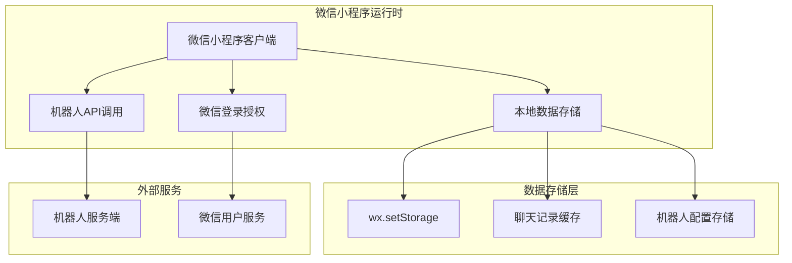

## 1. 架构设计



## 2. 技术描述

- **前端框架**: 微信小程序原生框架 + WeUI组件库
- **开发工具**: 微信开发者工具
- **UI框架**: WeUI for 小程序 (微信官方UI组件库)
- **数据存储**: 微信小程序本地存储API (wx.setStorage/wx.getStorage)
- **用户认证**: 微信登录授权 (wx.login, wx.getUserProfile)
- **网络请求**: 微信小程序HTTP API (wx.request)

## 3. 页面路由定义

| 路由 | 目的 |
|-------|--------|
| /pages/index/index | 消息页面，显示聊天列表 |
| /pages/chat/chat | 聊天页面，与机器人对话 |
| /pages/robot/robot | 机器人管理页面 |
| /pages/robot-detail/robot-detail | 机器人详情页面 |
| /pages/profile/profile | 我的页面，用户信息 |
| /pages/add-robot/add-robot | 添加机器人页面 |

## 4. 数据模型定义

### 4.1 用户模型 (User)
```javascript
{
  id: string,           // 微信用户唯一标识
  nickname: string,     // 用户昵称
  avatarUrl: string,    // 用户头像URL
  loginTime: timestamp  // 登录时间
}
```

### 4.2 机器人模型 (Robot)
```javascript
{
  id: string,           // 机器人唯一标识
  name: string,         // 机器人名称
  description: string,  // 机器人描述
  serviceUrl: string,   // 服务地址
  apiKey: string,       // API密钥
  avatar: string,       // 机器人头像URL
  createdAt: timestamp, // 创建时间
  lastChatAt: timestamp // 最后聊天时间
}
```

### 4.3 消息模型 (Message)
```javascript
{
  id: string,           // 消息唯一标识
  robotId: string,      // 所属机器人ID
  content: string,      // 消息内容
  type: 'user' | 'robot', // 消息类型
  timestamp: timestamp, // 发送时间
  status: 'sent' | 'received' | 'failed' // 消息状态
}
```

### 4.4 聊天会话模型 (ChatSession)
```javascript
{
  robotId: string,      // 机器人ID
  robotName: string,    // 机器人名称
  lastMessage: string,  // 最后一条消息内容
  lastMessageTime: timestamp, // 最后消息时间
  unreadCount: number,  // 未读消息数
  messages: Message[]   // 消息列表
}
```

## 5. 核心功能实现

### 5.1 微信登录流程
```javascript
// 登录流程
wx.login({
  success: (res) => {
    const code = res.code;
    // 获取用户信息
    wx.getUserProfile({
      desc: '用于完善用户资料',
      success: (userRes) => {
        const userInfo = userRes.userInfo;
        // 存储用户信息到本地
        wx.setStorageSync('userInfo', userInfo);
      }
    });
  }
});
```

### 5.2 机器人API调用
```javascript
// 发送消息到机器人
async function sendMessageToRobot(robotId, message) {
  const robot = getRobotById(robotId);
  
  wx.request({
    url: robot.serviceUrl,
    method: 'POST',
    header: {
      'Content-Type': 'application/json',
      'Authorization': `Bearer ${robot.apiKey}`
    },
    data: {
      message: message,
      userId: getCurrentUserId()
    },
    success: (res) => {
      // 处理机器人回复
      saveRobotMessage(robotId, res.data.reply);
    },
    fail: (err) => {
      // 处理错误
      console.error('机器人API调用失败:', err);
    }
  });
}
```

### 5.3 本地数据存储管理
```javascript
// 数据存储工具类
class StorageManager {
  // 存储机器人列表
  static saveRobots(robots) {
    wx.setStorageSync('robots', robots);
  }
  
  // 获取机器人列表
  static getRobots() {
    return wx.getStorageSync('robots') || [];
  }
  
  // 存储聊天记录
  static saveChatHistory(robotId, messages) {
    const key = `chat_${robotId}`;
    wx.setStorageSync(key, messages);
  }
  
  // 获取聊天记录
  static getChatHistory(robotId) {
    const key = `chat_${robotId}`;
    return wx.getStorageSync(key) || [];
  }
  
  // 存储用户信息
  static saveUserInfo(userInfo) {
    wx.setStorageSync('userInfo', userInfo);
  }
  
  // 获取用户信息
  static getUserInfo() {
    return wx.getStorageSync('userInfo');
  }
}
```

## 6. 页面组件结构

### 6.1 消息页面组件
```json
{
  "navigationBarTitleText": "消息",
  "usingComponents": {
    "chat-list": "/components/chat-list/chat-list"
  }
}
```

### 6.2 聊天页面组件
```json
{
  "navigationBarTitleText": "聊天",
  "usingComponents": {
    "message-bubble": "/components/message-bubble/message-bubble",
    "message-input": "/components/message-input/message-input"
  }
}
```

### 6.3 机器人页面组件
```json
{
  "navigationBarTitleText": "机器人",
  "usingComponents": {
    "robot-card": "/components/robot-card/robot-card",
    "add-robot-button": "/components/add-robot-button/add-robot-button"
  }
}
```

## 7. 状态管理

### 7.1 全局状态管理
```javascript
// app.js 全局状态
App({
  globalData: {
    userInfo: null,
    currentChatRobot: null,
    robots: [],
    chatSessions: []
  },
  
  onLaunch() {
    // 初始化数据
    this.loadUserInfo();
    this.loadRobots();
  },
  
  loadUserInfo() {
    const userInfo = StorageManager.getUserInfo();
    if (userInfo) {
      this.globalData.userInfo = userInfo;
    }
  },
  
  loadRobots() {
    const robots = StorageManager.getRobots();
    this.globalData.robots = robots;
  }
});
```

### 7.2 页面间通信
```javascript
// 使用事件总线进行页面间通信
const eventBus = {
  events: {},
  
  on(event, callback) {
    if (!this.events[event]) {
      this.events[event] = [];
    }
    this.events[event].push(callback);
  },
  
  emit(event, data) {
    if (this.events[event]) {
      this.events[event].forEach(callback => callback(data));
    }
  }
};
```

## 8. 错误处理与用户体验

### 8.1 网络错误处理
```javascript
// 统一的错误处理
function handleRequestError(error) {
  if (error.errMsg.includes('network')) {
    wx.showToast({
      title: '网络连接失败',
      icon: 'none'
    });
  } else if (error.errMsg.includes('timeout')) {
    wx.showToast({
      title: '请求超时',
      icon: 'none'
    });
  } else {
    wx.showToast({
      title: '请求失败，请重试',
      icon: 'none'
    });
  }
}
```

### 8.2 加载状态管理
```javascript
// 页面加载状态
Page({
  data: {
    loading: false,
    error: null,
    messages: []
  },
  
  async loadMessages() {
    this.setData({ loading: true, error: null });
    
    try {
      const messages = await this.fetchMessages();
      this.setData({ messages, loading: false });
    } catch (error) {
      this.setData({ error: error.message, loading: false });
      handleRequestError(error);
    }
  }
});
```

## 9. 性能优化

### 9.1 数据分页加载
```javascript
// 聊天记录分页加载
Page({
  data: {
    messages: [],
    hasMore: true,
    page: 1,
    pageSize: 20
  },
  
  onReachBottom() {
    if (this.data.hasMore) {
      this.loadMoreMessages();
    }
  },
  
  async loadMoreMessages() {
    const { page, pageSize } = this.data;
    const newMessages = await this.fetchMessages(page, pageSize);
    
    this.setData({
      messages: [...this.data.messages, ...newMessages],
      hasMore: newMessages.length === pageSize,
      page: page + 1
    });
  }
});
```

### 9.2 图片懒加载
```javascript
// 头像懒加载
Component({
  properties: {
    avatarUrl: String,
    lazyLoad: {
      type: Boolean,
      value: true
    }
  },
  
  methods: {
    onImageLoad() {
      // 图片加载完成处理
    },
    
    onImageError() {
      // 使用默认头像
      this.setData({ avatarUrl: '/images/default-avatar.png' });
    }
  }
});
```